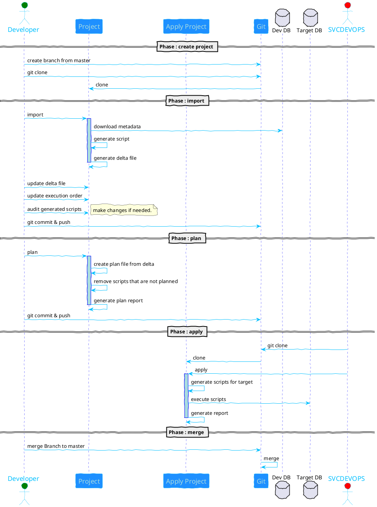

# Hashmap DataDefinitionOps

An alternative approach utility for data warehouse DevOps for Snowflake

Database DevOps has been an ongoing challenge with few players in comparison to other functionalities like Data synchronization, Data Validation, Data governance, etc… We get asked by customers, on every engagement to define and implement DevOps for their Datawarehouse (Snowflake) implementation. In general, database DevOps has involved quite a bit of complexity and ongoing tweaking to try and get it right. There are some tools available in the market today including:
- Sqitch
- Snowchange
- Redgate
- etc...

Most of these are imperative style. In an earlier article, I also had developed a declarative approach for [Don’t Do Analytics Engineering in Snowflake Until You Read This](https://medium.com/hashmapinc/dont-do-analytics-engineering-in-snowflake-until-you-read-this-hint-dbt-bdd527fa1795), which had been implemented in multiple clients.

Of late though, I had realized that in a typical development environment clients end up with tools like Erwin or Squirrel, etc… which creates these tables on the development database. Not all analysts can keep track of the latest changes in their Snowflake development database and inform the developer of what needs to get promoted.
Tools like Sqitch, Flyway, etc works by you developing the script and ensuring you are aware of what needs to get promoted. They also maintain deployment history by storing the state of deployment on a set of tables in the database or a schema. Apart from the naming of the script, there is no clear direction of what is actually getting deployed. If there is a new table getting deployed vs a new stage getting created. Also, you still will need to use 
GIT for storing the code as a safe practice. 

These and other factors got me thinking about an alternative approach to perform Database DevOps. I wanted to come from the direction that

- It does not matter how you had created the tables, views, and other database objects; we should be able to identify what gets changed from the last deployment.
- Git is not just version control for code, you can store states and keep track of state changes over multiple releases. Widely adopted in the software engineering/development phase there are well-defined, documented approaches to revert, changes, etc...
- All most all database has some form of metadata database or schema, INFORMATION_SCHEMA in case of Snowflake, which reflects the current state of various objects defined in it.
- Using information from the metadata we could technically reconstruct the object. Tools like Squirrel etc generate DDL scripts at any time using this approach.

Sounds compelling? If I have piqued your interest then what if I say the above is possible and I am sharing with you an Alpha version of the ‘Hashmap DataDefinitionOps’. 

## Solution
The solution uses
- Git as a state store
- The underlying database metadata repository as a source for changes
- Python as the implementation language.

If you have used sqitch or terraform, the approach is similar to those where you have defined phases (import, plan & apply) where by you have specific activities that you perform. 

### Phases and Action sequence
Before I walk through those phases, the following sequence diagram would give an insight on the approach wholistically. Obviously, there are some deeper level functionalities or details that are not covered here but will be explained in later sections. 

continue to XXXX for further understanding

## Features
These are current implemented features:

 - Specific implementation for Snowflake
 - Identify what has been added since last deployment or fresh start
 - Detect if column has been added or modified
 - Templatized jinja script
 - Apply to multiple targets without any modifications
 - Dry run script generated for specific target
 - Store state in git for future deployment 
 - DDL generated for
	 - Schema
	 - Table (create & alter)
	 - View
	 - Functions
	 - Procedures
	 - Grants
 - Modify generated script with additional Snowflake specific capabilities
 - Substitute environment variable in generated DDL scripts
 - dry run script generation

 
